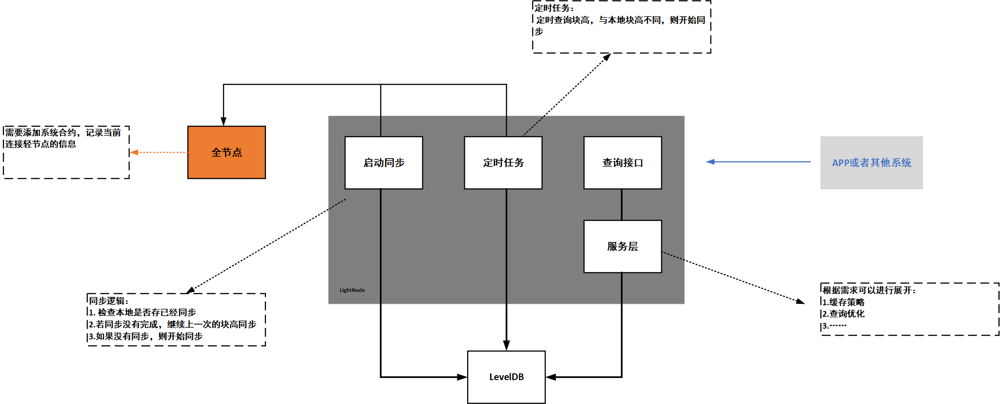

# Light node for Justitia
## 项目介绍
为Jusitia区块链项目添加轻节点客户端。架构设计如图：



## 使用说明：
1. 在配置文件中填好一下信息：
    ```
    # 全节点URL,Justitia节点
    Full_Node=http://127.0.0.1:47768
    
    # leveldb 文件位置，同步的receipt存放的地方，目前使用的相对地址，会保存在项目目录下，也可使使用绝对地址
    LevelDB_filePath=db/test.db
    ```
   Justitia区块链使用，参见社区：[https://github.com/DSiSc/justitia](https://github.com/DSiSc/justitia)  
2. 起动Springboot项目   
起动之后，会自动同步所有的区块的receipt信息，通过日志就能看出。

3. 访问浏览器
增加了查询块高的接口，浏览器访问：[http://127.0.0.1:8080/simple/blockheight](http://127.0.0.1:8080/simple/blockheight)
即可获得轻节点中同步的块高
